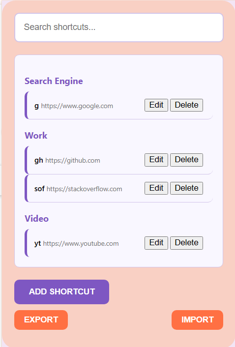

# Smart URL Redirector

Smart URL Redirector is a Chrome extension that allows you to create custom URL navigation shortcuts. Easily manage and use shortcuts to quickly navigate to your favorite websites.

## Features

- **Create Shortcuts**: Add new shortcuts with a keyword and URL.
- **Edit Shortcuts**: Modify existing shortcuts.
- **Delete Shortcuts**: Remove shortcuts you no longer need.
- **Categorize Shortcuts**: Organize shortcuts into categories such as Search Engine, Social, Work, and Video.
- **Add New Categories**: Create custom categories for your shortcuts.
- **Search Shortcuts**: Quickly find shortcuts using the search bar.
- **Shortcut Suggestions**: Get suggestions based on your browsing history.
- **Export Shortcuts**: Export your shortcuts to a JSON file.
- **Import Shortcuts**: Import shortcuts from a JSON file.
- **Omnibox Integration**: Use the Chrome omnibox to quickly navigate using your shortcuts.

## Installation

1. Clone the repository or download the ZIP file.
2. Open Chrome and go to `chrome://extensions/`.
3. Enable "Developer mode" in the top right corner.
4. Click "Load unpacked" and select the extension directory.

## Usage

1. Click on the extension icon to open the popup.
2. Use the search bar to find existing shortcuts.
3. Click "Add Shortcut" to create a new shortcut.
4. Fill in the shortcut keyword, URL, and category. You can also add a new category.
5. Click "Save" to save the shortcut.
6. To edit or delete a shortcut, use the corresponding buttons next to each shortcut.
7. Use the export and import buttons to backup and restore your shortcuts.

## Permissions

- **Storage**: To save and retrieve shortcuts.
- **Tabs**: To update or create new tabs when navigating to a shortcut URL.
- **History**: To fetch browsing history for shortcut suggestions.

## Screenshots

## License

This project is licensed under the MIT License.
